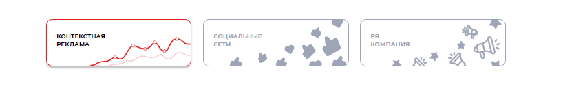
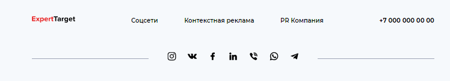
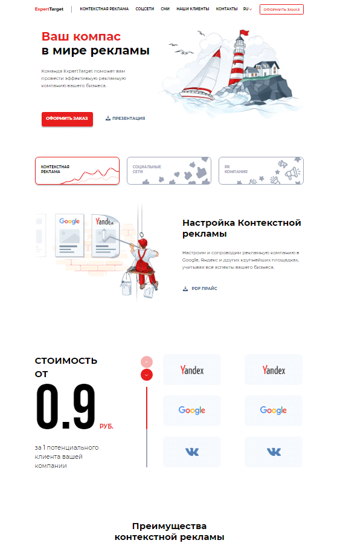
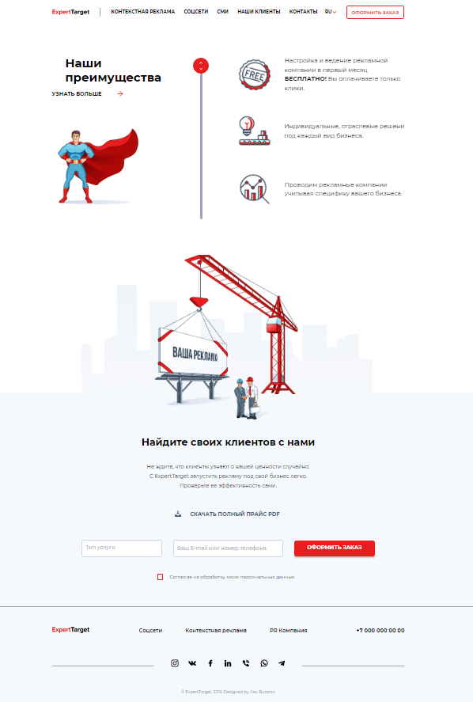
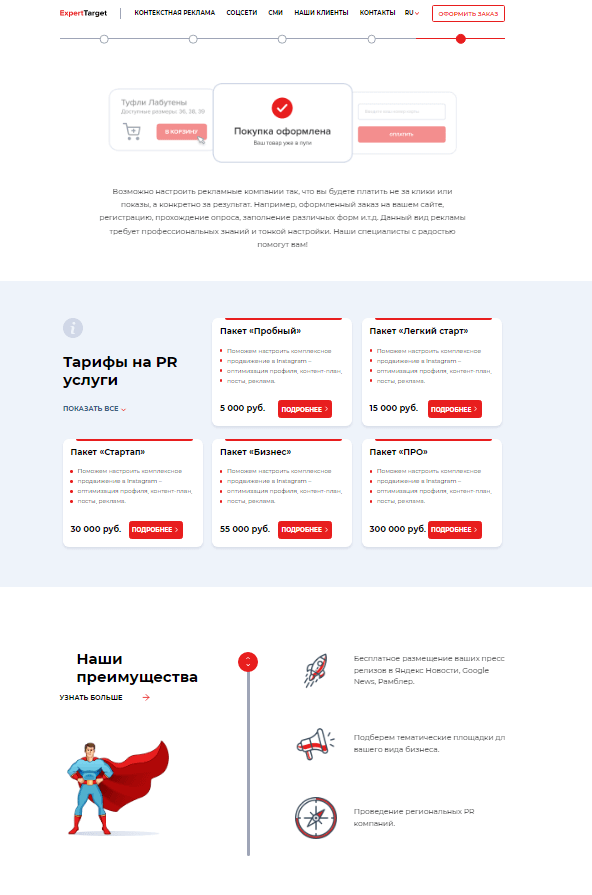
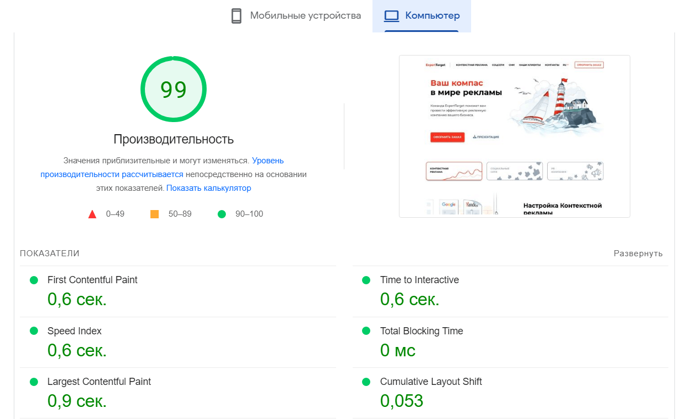

# Expert Target 

> Сайт для компании, занимающейся рекламным продвижением клиентов. 

https://semal17.github.io/expert/index.html

## Описание

Сайт для продвижения рекламных компаний. Продвижение происходит через социальные сети, контекстную рекламу и PR-компании. На сайте можно узнать, через какие социальные сети, сайты и сми компания продвигает своих клиентов. Там же можно ознакомиться с тарифами и ценами на них, узнать преимущества данной компании и оставить заявку для дальнейшей работы.

Переключаться между страницами сайта можно как в блоке навигации, так и в блоке ниже презентационного блока:

и внизу страниц:

## Cкриншоты

## Команды

<table>
  <thead>
    <tr>
      <th>Команда</th>
      <th>Результат</th>
    </tr>
  </thead>
  <tbody>
    <tr>
      <td width="30%"><code>npm install</code></td>
      <td>Установить зависимости</td>
    </tr>
    <tr>
      <td><code>gulp</code></td>
      <td>Запустить приложение в режиме разработки.</td>
    </tr>     
    <tr>
      <td><code>gulp build</code></td>
      <td>Собрать проект для продакшена</td>
    </tr>
  </tbody>
</table>

## Используемые технологии

HTML, CSS, JS, SCSS, GULP

